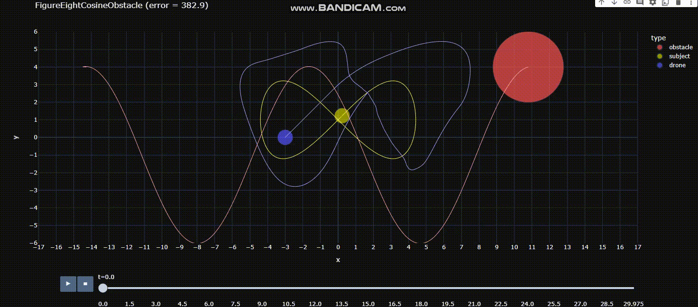

## MPC with a Quadrotor to track a moving subject while avoiding a moving obstacle

Link to solution: https://colab.research.google.com/drive/11OneVFQIDeRMdVRs3Kff1fRPsFj_Q7Tq#scrollTo=-dnaeE8jFxXo

In this project I implemented Model Predictive Control to enable a drone (blue) to track a moving subject (yellow) while avoiding a moving obstacle (red) using Potential Field Theory. 
Additional constraints involved tracking the subject from a specified relative angle while maintaining a desired range from subject. 

